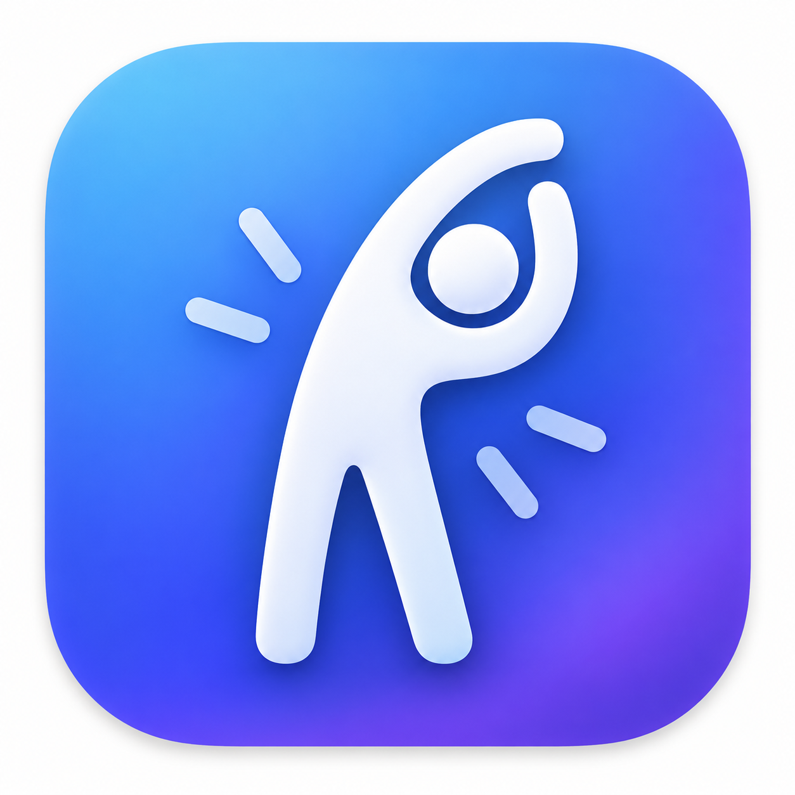

# StandUp

A lightweight native macOS menu bar utility that reminds you to take a short break after approximately 30 minutes of active computer work. It tracks *actual usage* — not wall-clock time — and automatically becomes quiet when you're in a video or voice call.

<p align="center">
  
</p>

## What StandUp Does

- Lives in the macOS menu bar with a live countdown showing remaining work time.
- After your configured work interval of active use, displays a **full-screen overlay** on the active display — a dark translucent layer covering the entire screen with the message and actions centered. The overlay blocks mouse interaction with apps underneath so you can't simply keep working, but Cmd+Tab, Force Quit, and all system shortcuts still work. It is a soft blocker, never a locked screen.
- Detects active voice/video calls via Core Audio process metadata and downgrades to a quiet, non-disruptive nudge during meetings.
- Returns to the aggressive reminder the moment your call ends.
- Pauses the work timer when you're idle and resets entirely after a long absence (natural break detection).
- Supports snooze, skip, pause, and manual Quiet Mode.

## macOS Requirement

**macOS 15.0 or later.** Built with Swift 6 and SwiftUI.

## How to Build

### Prerequisites

- Xcode 16.0 or later (tested on Xcode 27.0)
- macOS 15.0+ SDK

### Build from the command line

```bash
cd StandUp
xcodebuild -project StandUp.xcodeproj -scheme StandUp -configuration Release build \
    CODE_SIGN_IDENTITY="-" CODE_SIGNING_REQUIRED=NO CODE_SIGNING_ALLOWED=NO
```

### Run unit tests

Package-level logic tests (28 tests covering all spec scenarios):

```bash
cd StandUpCore
swift test
```

App-target smoke tests:

```bash
cd StandUp
xcodebuild -project StandUp.xcodeproj -scheme StandUp test \
    CODE_SIGN_IDENTITY="-" CODE_SIGNING_REQUIRED=NO CODE_SIGNING_ALLOWED=NO
```

## How to Run

### Install via Homebrew (recommended)

```bash
brew tap matanganon/standup
brew install --cask standup
```

This places `StandUp.app` in `/Applications`. Launch it from there or Spotlight.

### Manual install

1. Download the latest `StandUp-x.x.x.zip` from [GitHub Releases](https://github.com/matanganon/StandUp/releases).
2. Unzip and move `StandUp.app` to `/Applications`.
3. If you get a Gatekeeper warning (unsigned build), run once:
   ```bash
   xattr -dr com.apple.quarantine /Applications/StandUp.app
   ```
4. Open StandUp from Applications.

### Build from source

1. Build the project (see above).
2. Locate `StandUp.app` in Xcode's derived data or the build products directory.
3. Double-click `StandUp.app` or launch from the terminal:
   ```bash
   open /path/to/build/StandUp.app
   ```
4. A timer icon appears in the menu bar. Click it to see the panel.

There is no Dock icon and no Cmd-Tab entry — this is by design (`LSUIElement = true`).

### Fast-testing mode (DEBUG builds only)

To avoid waiting 30 minutes during manual QA, launch with compressed timings:

```bash
/path/to/StandUp.app/Contents/MacOS/StandUp --fast-testing
```

Or set the environment variable `STANDUP_FAST_TESTING=1`. This uses a 30-second work interval, 10-second break, and shortened debounce periods. Only available in Debug builds; production defaults are unchanged.

## How Meeting Detection Works

StandUp inspects Core Audio per-process audio metadata via the documented `kAudioHardwarePropertyProcessObjectList` and per-process `kAudioProcessProperty*` selectors. For each audio process on the system, it reads:

- `isRunningInput` — whether the process is actively using the microphone
- `isRunningOutput` — whether the process is producing audio output
- `bundleID` — the process's bundle identifier

It classifies processes into three categories:

1. **Known communication apps** (Zoom, Teams, Slack, FaceTime, Discord, etc.) — microphone input is a strong meeting signal; sustained audio output alone (mic muted) also counts after a debounce.
2. **Browsers** (Safari, Chrome, Edge, Firefox, Arc, etc.) — output alone is *not* a meeting (could be YouTube/music). Browser microphone input establishes a meeting, with a 120-second sticky grace period for mic muting.
3. **Unknown apps** — any process using microphone input triggers "protected audio activity" mode (quiet reminders), erring on the side of not interrupting recordings.

All transitions are debounced (3s to enter meeting, 8s to exit) to avoid flickering.

If the Core Audio process-list API is unavailable on the running system, StandUp falls back to normal reminders with manual Quiet Mode available from the menu bar panel.

## Privacy Model

StandUp is designed to be highly privacy-friendly:

- **StandUp never records microphone audio.** It only reads which processes have active audio input/output.
- **StandUp never reads keyboard contents.** It only reads seconds-since-last-input via `CGEventSource`, which returns a single number.
- **StandUp only checks idle duration and audio-process activity metadata.**

StandUp has:
- No analytics, no telemetry
- No accounts, no backend
- No network activity
- No cloud synchronization
- No browser history, URL, or window-title inspection

## What Permissions Are Required

StandUp requires **no special permissions** for its core functionality:

- The idle-time API (`CGEventSource.secondsSinceLastEventType`) does not require Input Monitoring or Accessibility permission.
- The Core Audio process-list inspection does not require Microphone or Screen Recording permission.

**Note:** The app runs outside the App Sandbox because the Core Audio process metadata inspection requires reading other processes' audio objects. No sandboxing entitlement is currently in use. If distributed via the App Store in the future, a suitable entitlement or alternative detection mechanism would be needed.

## How Launch at Login Works

StandUp uses Apple's `SMAppService.mainApp` API to register/unregister for launch at login. The Settings toggle reflects the real macOS registration status, and surfaces a link to System Settings if manual approval is required.

## Known Limitations

- **Meeting detection depends on Core Audio process metadata.** If a communication app uses a non-standard audio pipeline, it may not be detected. Manual Quiet Mode is always available as a fallback.
- **Browser-based meetings** (Google Meet, etc.) are detected only when the browser's microphone is active or was recently active with ongoing audio output. A browser call that never uses the microphone (listen-only) will not be detected.
- **Non-sandboxed.** The Core Audio process-list API requires reading other processes' audio objects, which is not available in the App Sandbox.
- **No automatic updater** in this MVP.
- **Statistics are local only** and stored in UserDefaults. They reset daily.
- The idle-time API reports system-wide idle time. If a second user session is active, their activity may affect the idle reading (unlikely in normal single-user Mac use).
- Full-screen and multi-monitor reminder placement uses `NSEvent.mouseLocation` as a heuristic and may occasionally appear on the wrong screen if the mouse is moved at the exact moment the reminder appears.

## Architecture

```
StandUp (Xcode macOS app target)
├── StandUpApp.swift          — @main entry, MenuBarExtra + Settings scenes
├── AppModel.swift            — composition root, scheduler loop, wiring
├── Views/
│   ├── MenuBarLabelView      — SF Symbols + monospaced countdown
│   ├── MenuBarContentView    — popover panel
│   ├── BreakReminderView     — aggressive panel content
│   ├── MeetingReminderView   — quiet panel content
│   └── SettingsView          — General / Reminders / Meetings tabs
├── AppKit/
│   ├── FloatingPanel          — NSPanel configured for non-activating floating
│   ├── BreakReminderWindowController
│   ├── MeetingReminderWindowController
│   └── ScreenPlacement        — multi-monitor placement
└── Services/
    ├── SystemUserActivityMonitor   — CGEventSource idle time
    ├── CoreAudioMeetingDetector    — per-process audio metadata
    ├── WorkspaceLifecycleMonitor   — NSWorkspace sleep/wake/lock
    ├── ReminderPresenter           — bridges ReminderPresenting → panels
    ├── LaunchAtLoginService        — SMAppService
    ├── PersistenceStore            — UserDefaults Codable store
    └── Log                         — OSLog categories

StandUpCore (local Swift Package)
├── BreakCoordinator     — central @MainActor @Observable state machine
├── MeetingDecisionReducer — pure debounced meeting classifier
├── BreakState / MeetingState / AppSettings / DailyStats — models
├── Protocols            — UserActivityMonitoring, MeetingDetecting, etc.
├── TimeProvider         — injectable clock (real + mock)
├── Constants            — intervals, bundle-ID sets
└── Mocks               — test doubles for all protocols
```

## Apple Frameworks Used

- SwiftUI, AppKit, Observation
- CoreAudio (per-process metadata, no capture)
- CoreGraphics (idle time)
- ServiceManagement (launch at login)
- OSLog (structured logging)
- Foundation, Combine (minimal)
